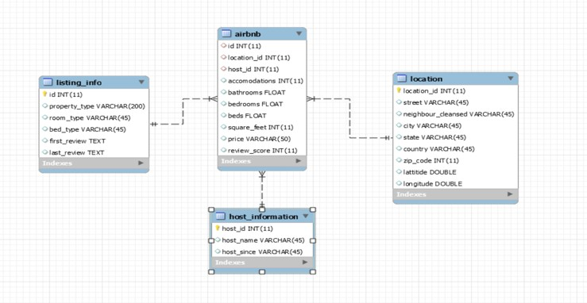
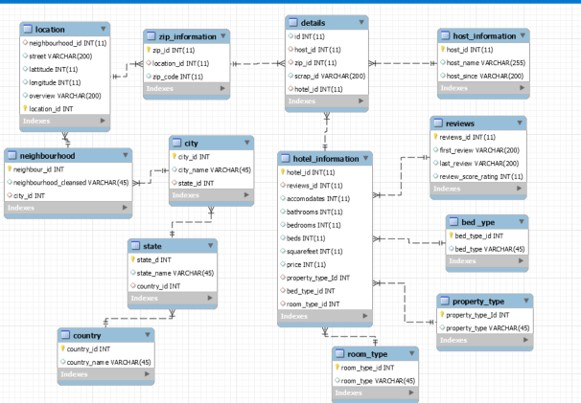
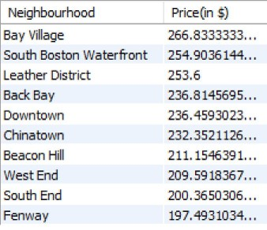
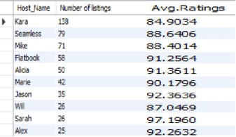
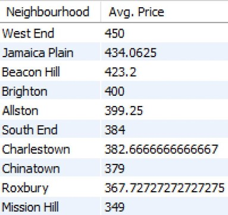
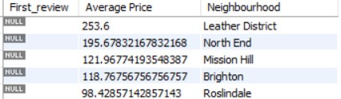
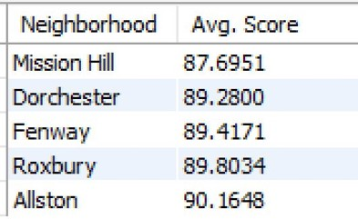

# Dataset Description

The data consists of details of Airbnb rentals.

Below given star schema shows us the database - 

Each row consists of details regarding host information, location of the rental, rentals neighborhood overview, features of the rental with price and their reviews.

We have unique id in the data set that is related to the scrap information and also we have host id which is related to the host name and host since information.

We have location details from street to country along with the latitude and longitude numbers.

A review score is given to each row of entry in dataset for each Airbnb rentals.

We created a Snow Flake schema in its Third Normalized form as given below - 

# Business Questions
Which Neighbourhood Airbnb needs to invest more based on average price of areas??

Which Airbnb host has the highest listings so as to provide incentive schemes to help business growth??

Which Neighbourhoods should we promote in summer 2019 catering to large groups??

Identifying neighbourhoods which have most of the listings un reviewed.

To identify which are the lowest rated neighbourhoods in Boston to conduct marketing to improve ratings.

